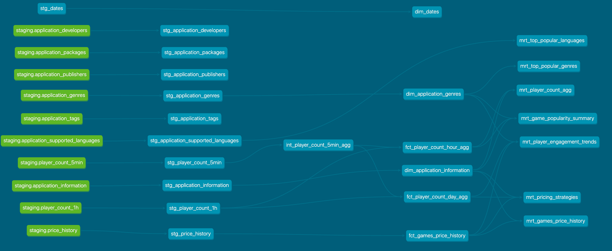

# Game Analytics with dbt

Welcome to the Game Analytics dbt project! This project is designed to leverage dbt (data build tool) to transform, analyze, and aggregate data related to games, their tags, and pricing information on the Steam platform. Our goal is to provide strategic insights into game popularity, player engagement, and pricing strategies to inform game development and marketing decisions.

## Project Overview

This dbt project includes models that combine game-related data from multiple sources, focusing on creating a comprehensive analysis layer for assessing game tags' popularity, understanding pricing impacts, and evaluating player engagement. It's structured to facilitate data transformation, enrichment, and aggregation, enabling detailed analytics and insights.

## Getting Started

To get started with this dbt project, you'll need to have dbt installed and configured for your target database. Follow the installation guide on the [dbt documentation](https://docs.getdbt.com/dbt-cli/installation) page if you haven't set up dbt yet.

### Initial Setup

1. Clone this repository to your local machine.
2. Navigate to the project directory and install dependencies (if any).
3. Configure your `profiles.yml` to connect to your data warehouse (refer to the [dbt profiles documentation](https://docs.getdbt.com/dbt-cli/configure-your-profile) for guidance).

### Running the Project

Within the project directory, you can use the following commands to run transformations and tests:

- To run all models: `dbt run`
- To test all models: `dbt test`

### Project Structure

- `models/`: Contains all dbt models, organized into subdirectories representing different layers of transformation (e.g., staging, marts).
- `data/`: Includes any seed data files used in the project.
- `tests/`: Contains custom data tests.
- `macros/`: Stores macros that are used across models for custom logic or repeated SQL snippets.
- `analysis/`: Holds ad-hoc analysis and exploration SQL files.
- `dbt_project.yml`: The main project configuration file.

### Key Models

- `mrt_games_price_history`: Mart layer with historical game pricing information.
- `mrt_player_count_agg`: Mart layer with aggregated player count statistics.

### Data Model Lineage 

### Dashboard
A draft of the dashboard in Google Data Studio, which utilizes data from the mart layer, can be viewed at the following link:

[View Dashboard](https://lookerstudio.google.com/reporting/485dc6c8-b4d9-40be-9dee-1fa5a9c0246e)

This dashboard provides visualizations of key metrics derived from our dbt models, including:
- Price history and discount rates per game
- Player count statistics per game

### Resources

- **dbt Documentation**: Comprehensive guide and reference for dbt [docs.getdbt.com](https://docs.getdbt.com/)
- **dbt Discourse**: A community forum for questions and answers [community.getdbt.com](https://community.getdbt.com/)
- **dbt Slack**: Join the dbt community on Slack for live discussions [slack.getdbt.com](https://slack.getdbt.com/)
- **dbt Events**: Find upcoming dbt events and meetups [events.getdbt.com](https://events.getdbt.com/)
- **dbt Blog**: Stay updated with the latest news and best practices [blog.getdbt.com](https://blog.getdbt.com/)
